# DOOM for WiFi Pineapple Pager

Play the classic 1993 FPS on your WiFi Pineapple Pager!

[](https://www.youtube.com/live/Er7XwjwmfIU?si=CsJcLTFFy_HVQuCv&t=15302)
*Darren Kitchen demoing DOOM on the Pager — [watch the full video](https://www.youtube.com/live/Er7XwjwmfIU?si=CsJcLTFFy_HVQuCv&t=15302)*

## Quick Install

### Using Pull Payload PR

If you have the `general` → `Pull Payload PR` payload on your pager, type PR `130` to install.

### Manual Install

Copy the pre-built files to your Pager:

```bash
scp -r payloads/user/games/doom root@172.16.52.1:/root/payloads/user/games/
```

Then find DOOM in: **Payloads → Games → DOOM**

## Supported WADs

| | |
|:---:|:---:|
| 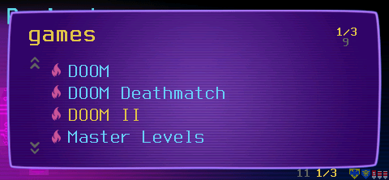 | 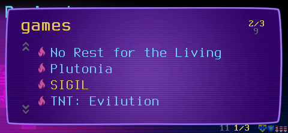 |

**Bring your own WADs!** Only the shareware `doom1.wad` is included. Place your legally obtained WAD files in the `wads/` directory to play the full games.

### IWADs (Base Games)

| Game | WAD File | Status |
|------|----------|--------|
| DOOM Shareware | `doom1.wad` | ✅ Works |
| DOOM Registered | `doom.wad` | ✅ Works |
| DOOM II | `doom2.wad` | ✅ Works |
| Final DOOM: TNT | `tnt.wad` | ✅ Works |
| Final DOOM: Plutonia | `plutonia.wad` | ✅ Works |

| | |
|:---:|:---:|
| 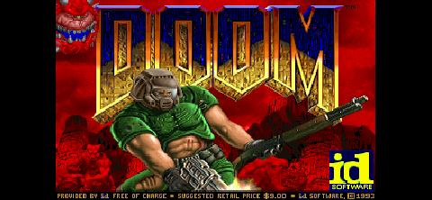 | 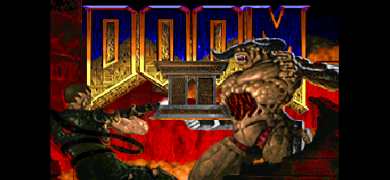 |
| 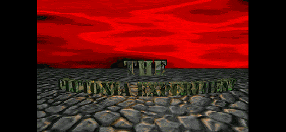 | 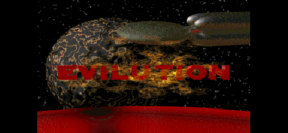 |

### PWADs (Add-ons)

| Add-on | WAD File | Requires | Status |
|--------|----------|----------|--------|
| No Rest for the Living | `nerve.wad` | `doom2.wad` | ✅ Works |
| Master Levels | `masterlevels.wad` | `doom2.wad` | ✅ Works |
| SIGIL | `sigil.wad` | `doom.wad` | ✅ Works (Episode 3) |
| SIGIL II | `sigil2.wad` | `doom.wad` | ❌ Incompatible |

| | |
|:---:|:---:|
| 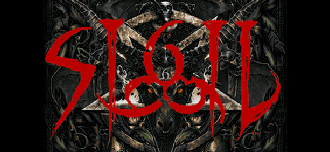 | 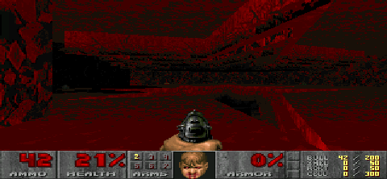 |
| 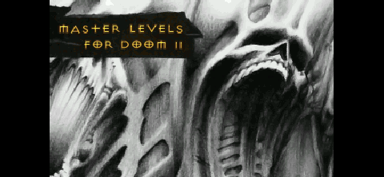 |  |

### Installing Additional WADs

1. Place your WAD files in the `wads/` directory
2. Run the installer:

```bash
./install-wads.sh list      # Show available configurations
./install-wads.sh install   # Create payload directories
./install-wads.sh deploy    # Deploy to Pager via SSH
```

### WAD Compatibility Notes

- **SIGIL** uses the "compat" version which replaces Episode 3 (select Episode 3 in menu)
- **SIGIL II** is NOT compatible (requires UMAPINFO support)

## Controls

| Input | Action |
|-------|--------|
| D-pad | Move/Turn |
| Red | Fire |
| Green | Select (menus) |
| Green + Up | Open doors/Use |
| Green + Down | Automap |
| Green + Left/Right | Strafe |
| Red + Green | ESC (Menu/Quit) |

### USB Keyboard Support

External USB keyboards work alongside the Pager's built-in buttons. **Plug in your keyboard before launching the game** - input devices are detected at startup.

## Multiplayer Deathmatch

Connect to our public DOOM server for multiplayer deathmatch!

| | |
|:---:|:---:|
| 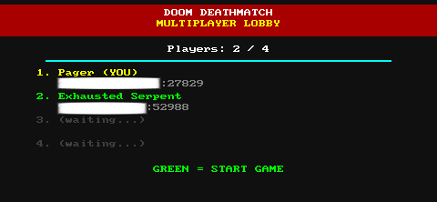 | 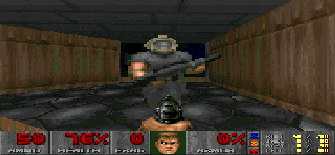 |

Run the **DOOM Deathmatch** payload from: Payloads → Games

Desktop players can join with Chocolate Doom:
```bash
chocolate-doom -iwad doom1.wad -connect 64.227.99.100:2342
```

### Network Features
- Chocolate Doom 3.1.x protocol compatibility
- Works with vanilla Chocolate Doom server
- POSIX socket-based network layer (no SDL dependency)

## Build from Source

```bash
./build.sh
```

This will:
1. Download the OpenWrt SDK (~400MB, cached in `build/`)
2. Clone our [doomgeneric fork](https://github.com/lmacken/doomgeneric-pager) (`pager` branch)
3. Cross-compile for MIPS
4. Deploy to Pager (if connected)

For experimental builds, use `./build.sh --dev` which pulls from the `dev` branch and creates a separate `DOOM DEV` payload.

### Requirements

- Linux (tested on Ubuntu/Debian)
- `curl`, `git`, `make`
- `qemu-user-static` (on non-x86_64 hosts)

```bash
sudo apt install curl git make qemu-user-static
```

## Screenshots

Capture a screenshot from your Pager's framebuffer and save it locally:

```bash
./screenshot.sh                  # Landscape (default)
./screenshot.sh -n               # Portrait (raw framebuffer)
./screenshot.sh my_shot.png      # Custom filename
```

## Technical Details

- **CPU**: MIPS 24KEc @ 580MHz (soft-float, 8-stage pipeline)
- **RAM**: 64MB DDR2
- **Display**: 222×480 RGB565 via SPI (~20 FPS refresh limit)
- **Input**: GPIO buttons via `/dev/input/event0`

### Rendering Limits (Increased for SIGIL and Complex WADs)

The vanilla DOOM engine has hardcoded limits that can cause crashes on complex maps like SIGIL. These have been increased:

| Limit | Original | Modified |
|-------|----------|----------|
| MAXVISPLANES | 128 | 512 |
| MAXVISSPRITES | 128 | 256 |
| MAXDRAWSEGS | 256 | 512 |

### Engine Modifications

**Display Pipeline**
- 16-bit RGB565 framebuffer support with direct writes
- 90° CCW rotation for portrait display orientation
- Full-screen stretched scaling with widened FOV (gameplay)
- Aspect-correct rendering with letterboxing (menus/title)
- Precomputed lookup tables for X/Y scaling (32-byte cache-aligned)

**Frame Pacing**
- Default 35 FPS cap matches DOOM's native TICRATE
- `usleep()`-based frame timing for consistent pacing
- Reduces CPU usage and heat compared to uncapped rendering
- Display limited to ~20 FPS via SPI, but 35 FPS ensures smooth game logic

**Input System**
- GPIO button mapping (red/green buttons)
- Button combo detection with proper state tracking
- Strafe combos: Green+Left/Right for strafing
- Clean key release handling prevents stuck inputs
- USB keyboard support (detected at startup)

**Performance Optimizations**

| Optimization | Description |
|--------------|-------------|
| **RGB565 Palette Precomputation** | 256-entry palette converted to RGB565 once at load time, not per-pixel |
| **4-Pixel Loop Unrolling** | Inner render loop processes 4 pixels per iteration |
| **Direct I_VideoBuffer Access** | Skips redundant buffer copy in `I_FinishUpdate()` |
| **Cache-Aligned Tables** | Lookup tables aligned to 32-byte cache lines via `posix_memalign()` |
| **Binary Stripping** | Debug symbols removed (758KB vs 1.4MB) |

**Compiler Flags (MIPS 24KEc Tuned)**
```
-O3 -march=24kec -mtune=24kec -mdsp -mbranch-likely
-fomit-frame-pointer -ffast-math -funroll-loops
-fno-strict-aliasing -fno-exceptions
```

**Experimental: Cache Prefetch**

The `-prefetch` flag enables `__builtin_prefetch()` hints for the MIPS 24KEc's L1 cache:
- Prefetches next row's lookup table entry during scaling
- Prefetches ahead in source buffer (16 pixels)
- May improve performance on some WADs, disabled by default

### Payload Optimizations

The payload scripts stop background services before launching DOOM to maximize available CPU and RAM:

```bash
# Services stopped during gameplay
/etc/init.d/php8-fpm stop    # PHP FastCGI
/etc/init.d/nginx stop        # Web server  
/etc/init.d/bluetoothd stop   # Bluetooth daemon
/etc/init.d/pineapplepager stop
/etc/init.d/pineapd stop
```

All services are automatically restored when DOOM exits.

## Files

```
├── build.sh              # Main build script
├── install-wads.sh       # WAD installer tool
├── screenshot.sh         # Pager screenshot utility
├── doomgeneric/          # Engine fork (github.com/lmacken/doomgeneric-pager)
├── wads/                 # Place your WAD files here
├── img/                  # Screenshots
├── ansible/              # Deathmatch server playbook
└── payloads/             # Pager payload directories
    └── user/games/
        ├── doom/              # Base DOOM (shareware)
        ├── doom-deathmatch/   # Multiplayer
        ├── doom2/             # DOOM II
        ├── doom-sigil/        # SIGIL
        └── ...
```

## Future Ideas

- **Kernel module** (`doom_fb.ko`) for bypassing fbtft overhead and direct USB bulk transfers
- **DMA transfers** for framebuffer writes (CH347 USB-to-SPI bridge currently lacks DMA)
- **Dirty rectangle tracking** to only update changed screen regions
- **Vibrate when hit** using the Pager's vibration motor
- **DOOM theme ringtone** using the piezoelectric buzzer

## License

- DOOM source: GPL
- doom1.wad: Shareware (freely distributable)
