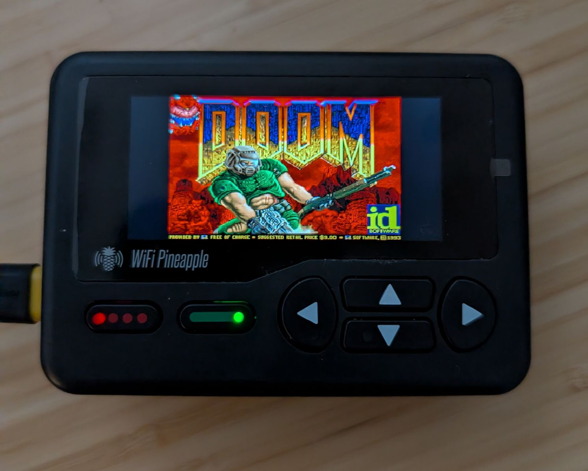
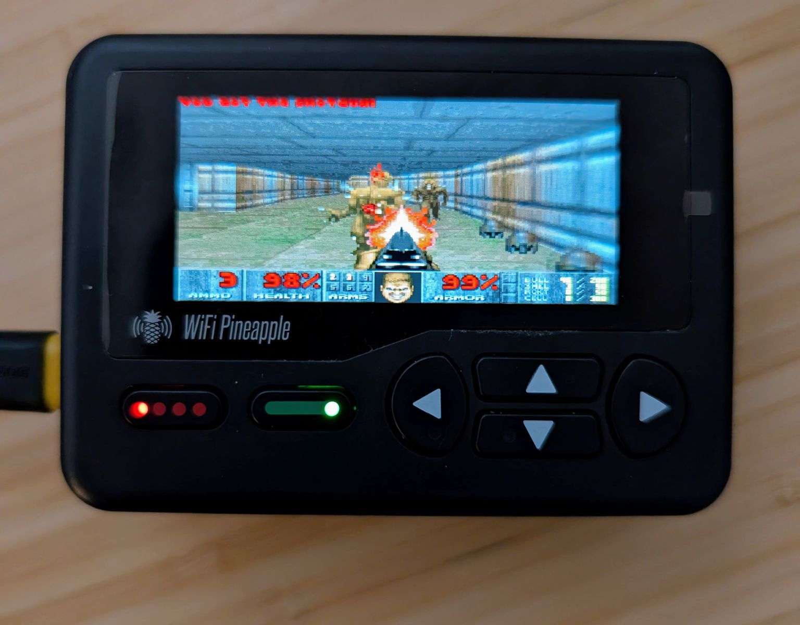
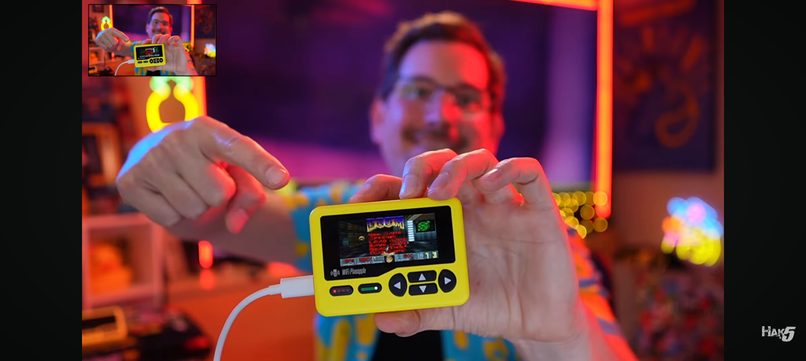
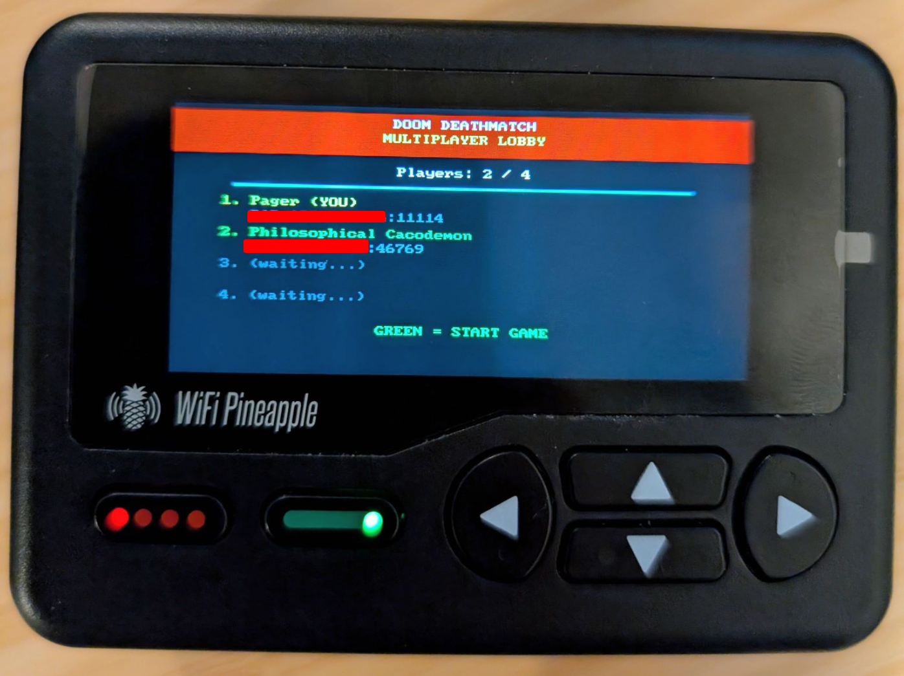

# DOOM for WiFi Pineapple Pager

Play the classic 1993 FPS on your WiFi Pineapple Pager!






## Install using `Pull Payload PR`

If you have the `general` -> `Pull Payload PR` payload on your pager, you can simply type in PR `130` and the game will be installed!

## Quick Install

Copy the pre-built files from `payloads/` to your Pager:

```bash
scp -r payloads/user/games/doom root@172.16.52.1:/root/payloads/user/games/
```

Then find DOOM in: **Payloads → User → Games → DOOM**

## Build from Source

```bash
./build.sh
```

This will:
1. Download the OpenWrt SDK (~400MB, cached in `build/`)
2. Clone doomgeneric
3. Apply our patches
4. Cross-compile for MIPS
5. Output to `release/` with SHA256 checksums

### Requirements

- Linux (tested on Ubuntu/Debian)
- `curl`, `git`, `make`
- `qemu-user-static` (on non-x86_64 hosts)

```bash
sudo apt install curl git make qemu-user-static
```

## Verify Build

Compare your build against the release checksums:

```bash
cd release/
cat SHA256SUMS
sha256sum -c SHA256SUMS
```

## Controls

| Input | Action |
|-------|--------|
| D-pad | Move/Turn |
| Red | Fire |
| Green | Select (menus) |
| Green + Up | Open doors |
| Green + Down | Automap |
| Green + Left/Right | Strafe |
| Red + Green | Quit |

## Technical Details

- **CPU**: MIPS 24KEc @ 580MHz (soft-float)
- **Display**: 222×480 RGB565, rotated 90° CCW
- **Input**: GPIO buttons via `/dev/input/event0`

## Patch Features

Our `wifi-pineapple-pager.patch` adds:

**Display**
- 16-bit RGB565 framebuffer support
- 90° CCW rotation for portrait display
- Full-screen stretched scaling with widened FOV (gameplay)
- Aspect-correct rendering with letterboxing (menus/title)
- Precomputed lookup tables for fast scaling

**Input**
- GPIO button mapping (red/green buttons)
- Button combo detection:
  - Red + Green → ESC (quit/menu)
  - Green + Up → Use (open doors)
  - Green + Down → Automap toggle
  - Green + Left/Right → Strafe

**Performance**
- MIPS 24KEc optimizations (`-march=24kec -mdsp -mbranch-likely`)
- 4-pixel loop unrolling in render loop
- Inline RGB888→RGB565 conversion macro
- Aggressive compiler flags (`-O3 -ffast-math -funroll-loops`)

**System**
- Graphics mode switching (prevents console interference)
- Signal handlers for clean exit
- Skip quit confirmation dialog

## Files

```
├── build.sh                 # Build script
├── patches/                 # Patches for doomgeneric
├── payload.sh               # Single-player launcher
├── payload-deathmatch.sh    # Multiplayer deathmatch launcher
├── doom1.wad                # Shareware WAD (Episode 1)
├── ansible/                 # Server setup playbook
└── payloads/                # Ready for Hak5 payloads repo PR
    └── user/games/doom/
```

## Multiplayer Deathmatch

Connect to our public DOOM server for multiplayer deathmatch with other Pager and desktop players!



Use `payload-deathmatch.sh` or run manually:

```bash
./doomgeneric -iwad doom1.wad -connect 64.227.99.100:2342
```

Desktop players can join with Chocolate Doom:
```bash
chocolate-doom -iwad doom1.wad -connect 64.227.99.100:2342
```

### Network Features
- Chocolate Doom 3.1.x protocol compatibility
- Works with vanilla Chocolate Doom server
- POSIX socket-based network layer (no SDL dependency)
- Full game state synchronization with consistency checks
- Ticcmd diff compression for efficient bandwidth usage

## More Patch Ideas

- further rendering optimizations (especially the intro demo)
- easy cheats
- external keyboard support
- DOOM theme ringtone jingle at startup

## License

- DOOM source: GPL
- doom1.wad: Shareware (freely distributable)
